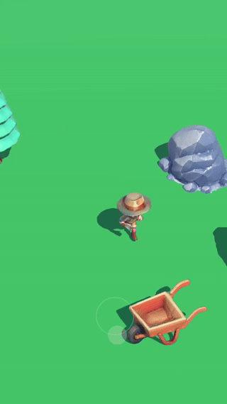

# ¡Hola, soy Iván! :colombia:

Soy un **Ingeniero Mecatrónico** apasionado por el desarrollo de videojuegos y experiencias inmersivas en Unity. Con más de seis años de experiencia, me dedico a crear soluciones innovadoras que combinan creatividad y tecnología, desde videojuegos educativos hasta plataformas de realidad virtual.

## Sobre mí 🕹️  
- **Desarrollador de videojuegos en Unity:** Estoy constantemente explorando nuevas mecánicas, interacción y sistemas avanzados para videojuegos.  
- **Apasionado por la realidad virtual y aumentada:** He desarrollado aplicaciones inmersivas publicadas en PlayStore y AppStore.  
- **Docente y mentor:** Disfruto compartir conocimiento sobre programación y desarrollo de videojuegos.  
- **Autodidacta y creativo:** Siempre buscando nuevas formas de integrar tecnología y arte.  
- **Foco en IA:** Implemento inteligencia artificial para optimizar procesos y mejorar experiencias de usuario.

---

## Proyectos destacados 🎮  
Aquí algunos repositorios interesantes que puedes explorar en mi perfil:  

| Proyecto | Descripción | Enlace |
| --- | --- | --- |
| **Character-Movement-Explorations** | Exploraciones sobre mecánicas de movimiento en Unity. | [Repositorio](https://github.com/iasarmientoj/Character-Movement-Explorations) |
| **Interaction-Mechanics-Explorations** | Pruebas de interacción: combate, disparos, empuje, y más. | [Repositorio](https://github.com/iasarmientoj/Interaction-Mechanics-Explorations) |
| **Game-Systems-Explorations** | Integración de publicidad móvil, guardado de partidas, cinemáticas y más. | [Repositorio](https://github.com/iasarmientoj/Game-Systems-Explorations) |
| **Advanced-Technologies-Explorations** | Realidad aumentada, simulaciones físicas, y otras tecnologías avanzadas. | [Repositorio](https://github.com/iasarmientoj/Advanced-Technologies-Explorations) |

---

## Mi pila tecnológica 🚀  

<table>
<tr>
    <td align="center"></td>
    <td align="center"></td>
    <td align="center"></td>
    <td align="center"></td>
    <td align="center"></td>
</tr>
<tr>
    <td align="center"></td>
    <td align="center"></td>
    <td align="center"></td>
    <td align="center"></td>
    <td align="center"></td>
</tr>
</table>

---

## Estadísticas  

  

